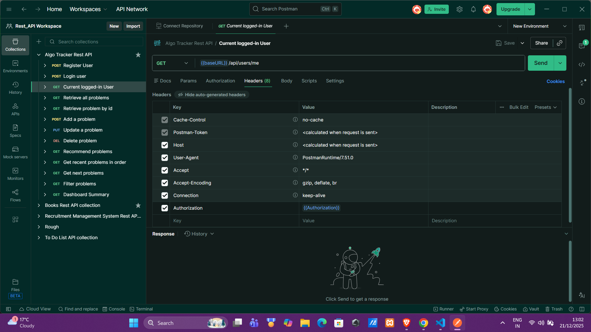

### AlgoTracker – DSA Practice & Progress Tracker (Spring Boot + JWT + MySQL)

AlgoTracker is a secure DSA practice & progress tracker built with **Spring Boot**, **Spring Security (JWT)**, and **MySQL**.
Users can register, log in, and manage their own DSA problems.
Each user only sees their own data, and under the hood the project demonstrates custom data structure
implementations (ArrayList, Stack, Queue, LinkedList) in real APIs.

# 📌 Core Features

1 Custom implementation of core Data Structures (e.g., LinkedList)

2 REST APIs to perform and track operations

3 Layered architecture (Controller → Service → Data Structure)

4 Clean separation of concerns

5 Maven-based Spring Boot project

6 Ready for future enhancements like dashboards & documentation

# 🛠️ Tech Stack

Java
Spring Boot
Spring Web (REST APIs)
Maven
Git & GitHub

# 📂 Project Structure
algotracker
│
├── src/main/java/com/anuj/algotracker
│   ├── controller        # REST controllers
│   ├── service           # Business logic
│   ├── datastructure     # Custom data structure implementations
│   └── AlgotrackerApplication.java
│
├── src/main/resources
│
├── pom.xml               # Maven configuration
├── mvnw / mvnw.cmd       # Maven wrapper
├── .gitignore
└── README.md

# How to Run the Project
1. Clone the Repository
   git clone https://github.com/Anuj-Kumar-1952/algotracker.git
2. Navigate to the project directory
   cd algotracker
3. Run the Application 
   ./mvnw spring-boot:run

🌐 API Usage
Once the application starts, the server runs on:
  http://localhost:8080/
  Use Postman or any REST client to interact with the APIs.
  
## 📸 API Testing (Postman)
Below is an example of testing a secured dashboard API using JWT authentication:

# 📈 Future Enhancements (Planned)

# 🧩 Phase Breakdown
- Phase 1 – Setup & Basics
- Phase 2: Authentication & Authorization (JWT)
# - Phase 3: Business Modules 
# *Phase 3: Custom Data Structures & Problem Intelligence*
Overview
Phase 3 focuses on strengthening the core logic of the application by introducing custom data structure implementations and intelligent problem-handling services.
This phase enhances how problems are stored, processed, tracked, and recommended to users.

✨ Key Features
🧩 Custom Data Structures
Implemented custom versions of commonly used data structures to understand internal workings and improve control over problem processing logic:
- Custom ArrayList
- Custom LinkedList
- Custom Stack
- Custom Queue

These implementations are used conceptually within the service layer to model real-world problem flows.

$ % Problem Intelligence Services % 
Introduced multiple services to improve user experience and problem tracking:

ProblemHistoryService
Tracks user problem-solving history.

ProblemQueueService
Handles queued problems using queue-based processing.

RecentSolvedService
Fetches recently solved problems for a user.

RecommendationService
Suggests problems based on user activity and history.

$ % 🔗 Domain Enhancements % $ 

Linked Problem → User using a ManyToOne relationship for authenticated ownership.

Extended controller and repository layers to support new Phase-3 services.
- Phase 4: Validation & Documentation 
- Phase 5: Deployment 
